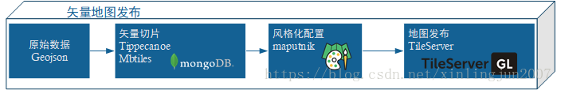

# GIS-Server

## 整体流程


## 矢量切片
1. 安装tippecanoe
```
sudo apt install libsqlite3-dev
git clone --depth=1 https://github.com/mapbox/tippecanoe.git
cd tippecanoe
make -j

当前项目将生成的二进制文件放入到了bin中, 可以直接使用bin中的命令
```

2. 使用tippecanoe切片
```
tippecanoe -z 15 -Z 0 -ps -Bg -o beijing.mbtiles beijing.json beijing_road.json

beijing.json beijing_road.json是两个geojson文件
```
参数说明:

| 参数 | 作用    |
| ---   | ---   |
| -z | 生成数据最大层级|
| -Z | 生成数据最小层级|
| -ps | 不要简化线条和多边形|
| -Bg | 自动抽稀，避免单个瓦片要素过多|
| -o  | 输出文件路径|

## 发布 mbtiles

1. 安装tileserver-gl-light
```
npm install tileserver-gl-light
```

2. 启动服务
```
tileserver-gl-light -c config.json
```
config.json配置说明
https://tileserver.readthedocs.io/en/latest/config.html#styles

## 转换工具
1. GDAL/OGR: 地理空间数据格式转换神器
```
https://gmt-china.org/blog/gdal-ogr/
```


2. 安装ogr2ogr
```
sudo apt-get install gdal-bin

// GDAL的OGR工具ogr2ogr使用参数说明
https://blog.csdn.net/qq_25662627/article/details/79653291

// 例如shp数据转成geojson
ogr2ogr -f GeoJSON beijing_road.geojson ./data/北京环路shp数据/Export_Output.shp

// shape 转mapinfo文件
ogr2ogr  -f "MapInfo File" -fieldTypeToString "Integer64" road Railway.shp

// shape转wkt格式
ogr2ogr -lco "GEOMETRY=AS_WKT" -lco "SEPARATOR=TAB" -f CSV railway.csv -sql "select LUA_ID from LandUseArea" LandUseArea.shp 
```


